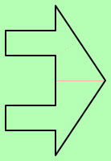

# Алгоритм быстрого определения принадлежности точки к полигону

Этот алгоритм основан на разбиении пространства на подпространства и создании дерева решения на основе этого разбиения. Далее, для проверки принадлежности точки к полигону, необходимо будет лишь пройтись по этому дереву поиска.

_Главная цель алгоритма:_ обеспечить максимальную скорость проверки; скорость создания дерева не учитывается.

Этот алгоритм в потенциале можно использовать для рейтрейсинга полигонов.

# Стандартный подход к решению этой задачи

Обычно, когда хотят проверить, принадлежит ли точка полигону, применяют стандартный подход: пускают луч из точки и находят его пересечение с ребрами полигона. Если справа и слева от точки находится нечетное количество пересечений, то точка внутри полигона.

Этот метод может быть хорош для растеризации полигона построчно, но он плох для определения принадлежности произвольной точки полигону, особенно когда таких проверок необходимо сделать много, и когда точки имеют не целые координаты.

Алгоритм на основе этого подхода находится в репозитории: [point\_in\_polygon](https://github.com/pglauner/point_in_polygon). Этот алгоритм будет использоваться для бенчмарков и будет называться `стандартный подход`. 

# Результат

Был написан алгоритм, который долго строит дерево, при этом иногда не очень правильно, это можно увидеть в секции тестов.

Основной код находится в `ftpip.cpp` в функции `makeTree`.

# Идея алгоритма

Разбиваем текущий полигон на две части при помощи простых проверок координат: либо проверки на принадлежность прямоугольнику, у которого стороны параллельны осям (класс QuadCheck), либо на прямоугольный треугольник, содержащийся в этом прямоугольнике (класс HalfQuadCheck).

Если надо, выбираем самое лучшее разбиение с помощью преобразования координат и матриц трансформации координат.

Далее каждую часть обрабатываем рекурсивно, до тех пор, пока не получим простейшие полигоны: прямоугольник, прямоугольный треугольник.

# Тесты производительности

|Количество вершин|Изображение|Этот алгоритм|Стандартный подход|Ускорение|Число неправильных пикселей|Время построения дерева|Высота дерева|
|-|-|-|-|-|-|-|-|
|3||49ms|298ms|6.0|0|0ms|1|
|3||73ms|366ms|5.0|0|0ms|1|
|4||83ms|666ms|8.0|0|0ms|1|
|4||159ms|614ms|3.8|0|0ms|1|
|4||38ms|297ms|7.8|0|0ms|1|
|4||64ms|395ms|6.1|0|0ms|1|
|7||268ms|809ms|3.0|0|2ms|7|
|7||205ms|613ms|2.9|1968|0ms|3|
|12||255ms|751ms|2.9|647|7ms|7|
|13||144ms|547ms|3.7|48024|7ms|6|
|50||184ms|1067ms|5.7|0|131ms|18|

Ускорение незначительное: в среднем в 4 раза.

Здесь не указано, но для построения дерева для полигона в 500 точек эллипса требует около минуты.

# Примеры построенных деревьев

Обозначения: 
* Зеленый: точка может сюда попасть (при движении по дереву) и в этом месте считается принадлежащей полигону.
* Красный: точка может сюда попасть и в этом месте считается не принадлежащей полигону.
* Циановый: если точка попадает сюда, то она идет на правую ветку. 
* Фиолетовый: если точка попадает сюда, то она идет на левую ветку.
* Светло-зеленый: точка не может сюда попасть, но если попадет, то считается принадлежащей полигону. Светлые цвета используются для дебага, чтобы определить границы циановых и фиолетовых областей, а так же определить тип листа дерева.
* Светло-красный, светло-циановый, светло-фиолетовый: аналогично светло-зеленому. 

# Выводы

* Алгоритм оказался очень сложным в реализации, с большим количеством зависимостей(в частности ему требуется алгоритм реализующий стандартный подход, ещё алгоритм нахождения пересечения полигонов, ещё библиотеки для преобразования координат: `spob`, `glm`). 
* Для своей сложности дает незначительное ускорение.
* Алгоритм не работает на сложных полигонах, и для правильной работы на них требует значительной доработки.
* Для большого количества точек работает слишком медленно.
* Если не использовать принудительные преобразования координат, то дерево может строиться до бесконечности.
* Не надо писать сложные алгоритмы, имея лишь идею, надо его сначала понять, и четко распланировать, постараться доказать самому себе его корректность. В данном случае ничего из этого не было соблюдено, поэтому и результаты получились печальные.

Поэтому данный проект забрасывается. Я думаю будет куда лучше посмотреть в сторону улучшения уже имеющегося алгоритма: [point\_in\_polygon](https://github.com/pglauner/point_in_polygon), добавив там [1D R-Tree](http://lin-ear-th-inking.blogspot.com/2007/06/packed-1-dimensional-r-tree.html) для поиска сторон. Это должно быть проще и, вероятно, увеличит скорость определения точки внутри полигона по сравнению с этим методом.